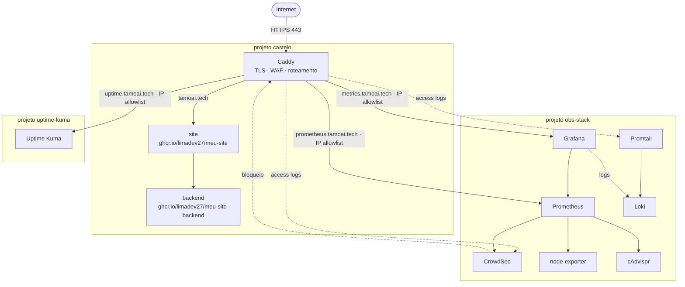

# 🏰 Trabalho-Infra_devops — Infraestrutura `tamoai.tech`

> Infraestrutura self-hosted em VPS único que serve a aplicação **tamoai.tech**: borda com TLS automático e WAF, observabilidade completa (métricas + logs) e monitoramento de disponibilidade. Tudo em Docker Compose, orquestrado em três projetos que se comunicam por redes dedicadas.


---

## 📋 Informações

| Item | Valor |
|---|---|
| Site público | https://tamoai.tech |
| Página de status | https://uptime.tamoai.tech *(acesso restrito por IP)* |
| Métricas / dashboards | https://metrics.tamoai.tech *(acesso restrito por IP)* |
| Prometheus | https://prometheus.tamoai.tech *(acesso restrito por IP)* |
| Aplicação (site + backend) | [limadev27/DevOps-Computa-o-em-Nuvem](https://github.com/limadev27/DevOps-Computa-o-em-Nuvem) |
| Infraestrutura (este repo) | [guisosi/Trabalho-Infra_devops](https://github.com/guisosi/Trabalho-Infra_devops) |
| Hospedagem | VPS único (Linux + Docker) |
| Integrantes | [@guisosi](https://github.com/guisosi) · [@limadev27](https://github.com/limadev27) |


---

## 📑 Índice

1. [Sobre o projeto](#1-sobre-o-projeto)
2. [Arquitetura](#2-arquitetura)
3. [Tecnologias](#3-tecnologias)
4. [Estrutura do repositório](#4-estrutura-do-repositório)
5. [Redes: como os três projetos conversam](#5-redes-como-os-três-projetos-conversam)
6. [Borda: Caddy (TLS, DNS-01 e roteamento)](#6-borda-caddy-tls-dns-01-e-roteamento)
7. [Segurança: CrowdSec e hardening](#7-segurança-crowdsec-e-hardening)
8. [Observabilidade: Prometheus, Grafana e Loki](#8-observabilidade-prometheus-grafana-e-loki)
9. [Disponibilidade: Uptime Kuma](#9-disponibilidade-uptime-kuma)
10. [Variáveis de ambiente](#10-variáveis-de-ambiente)
11. [Como subir](#11-como-subir)
12. [Limitações e próximos passos](#12-limitações-e-próximos-passos)

---

## 1. Sobre o projeto

Este repositório é a **camada de infraestrutura** do `tamoai.tech`. Ele não contém o código da
aplicação — o site e o backend vêm prontos como imagens no GHCR
(`ghcr.io/limadev27/meu-site` e `ghcr.io/limadev27/meu-site-backend`), construídas no
[repositório da aplicação](https://github.com/limadev27/DevOps-Computa-o-em-Nuvem). Aqui está
tudo o que **recebe o tráfego, protege, observa e monitora** essa aplicação.

São três projetos Docker Compose independentes, que rodam no mesmo host e se integram por redes
Docker compartilhadas:

| Projeto | Papel |
|---|---|
| `castelo/` | Borda (Caddy) + aplicação (site + backend) |
| `obs-stack/` | Observabilidade (métricas e logs) + motor de WAF (CrowdSec) |
| `uptime-kuma/` | Monitoramento de disponibilidade (status page) |

---

## 2. Arquitetura



**Fluxo em uma frase:** todo request entra pelo Caddy na 443; ele valida IP e passa pelo
CrowdSec antes de rotear para o destino (site, Grafana, Prometheus ou Uptime Kuma); em paralelo,
os logs do Caddy alimentam o CrowdSec (que bloqueia ataques) e o Loki (via Promtail, com GeoIP),
enquanto o Prometheus coleta métricas de todos os componentes.

---

## 3. Tecnologias

| Camada | Ferramenta | Função |
|---|---|---|
| Borda / proxy reverso | **Caddy** (imagem custom) | TLS automático, roteamento, compressão, bouncer do CrowdSec |
| Certificados | **Let's Encrypt** | Emissão automática; wildcard via DNS-01 |
| DNS | **Hostinger** (plugin Caddy) | Desafio DNS-01 para o certificado `*.tamoai.tech` |
| WAF / IPS | **CrowdSec** | Lê os logs do Caddy e bloqueia comportamento malicioso na borda |
| Métricas | **Prometheus** | Coleta de métricas (scrape a cada 15s) |
| Métricas de host | **node-exporter** | CPU, memória, disco, rede do host |
| Métricas de container | **cAdvisor** | Uso de recursos por container |
| Dashboards | **Grafana** | Visualização de métricas e logs |
| Logs | **Loki** + **Promtail** | Agregação de logs de todos os containers, com GeoIP nos acessos |
| Disponibilidade | **Uptime Kuma** | Monitoramento e página de status |
| Execução | **Docker Compose** | Orquestração dos três projetos |

---

## 4. Estrutura do repositório

```
.
├── castelo/                      # borda + aplicação
│   ├── compose.yaml              # site, backend, caddy
│   ├── infra/
│   │   ├── Caddyfile             # roteamento, TLS, allowlists
│   │   └── Dockerfile.caddy      # Caddy + plugins (CrowdSec, Hostinger DNS)
│   └── data/                     # runtime do Caddy (certificados etc.) — ignorado no git
│
├── obs-stack/                    # observabilidade + segurança
│   ├── docker-compose.yml        # crowdsec, prometheus, grafana, loki, promtail, node-exporter, cadvisor
│   ├── prometheus.yml            # alvos de scrape
│   ├── grafana-datasources.yaml  # datasource do Grafana
│   ├── loki-config.yaml          # config do Loki
│   ├── promtail-config.yaml      # coleta de logs + GeoIP
│   └── acquis.yaml               # fontes de log do CrowdSec
│
├── uptime-kuma/
│   └── compose.yaml              # Uptime Kuma
│
├── .gitignore                    # ignora .env, chaves, certificados e dados de runtime
└── README.md
```

> Os arquivos `.env`, chaves privadas, certificados e as pastas `data/` **não** estão versionados
> (ver `.gitignore`). Só as configurações entram no repositório.

---

## 5. Redes: como os três projetos conversam

A integração entre projetos separados é feita por **três redes Docker**:

| Rede | Tipo | Quem usa | Para quê |
|---|---|---|---|
| `castelo_web` | interna | site, backend, caddy, uptime-kuma | Tráfego da aplicação; sem acesso externo |
| `castelo_edge` | bridge | caddy, uptime-kuma | Camada de borda |
| `obs` | externa | caddy, crowdsec, prometheus, grafana, loki… | Liga o Caddy à stack de observabilidade |

A rede `obs` é declarada como **externa** nos dois lados, com nome fixo. É isso que permite o
Caddy (do projeto `castelo`) falar com o Grafana e o Prometheus (do projeto `obs-stack`) e o
CrowdSec ler os logs do container `castelo-caddy-1`. Por isso ela precisa existir **antes** de
subir as stacks (ver [Como subir](#11-como-subir)).

---

## 6. Borda: Caddy (TLS, DNS-01 e roteamento)

O Caddy é a única porta de entrada — o único container com portas publicadas (80 e 443). Imagem
custom (`Dockerfile.caddy`) com os plugins de CrowdSec e do provedor DNS Hostinger.

**Certificados:**
- Domínio raiz e subdomínios públicos: Let's Encrypt via HTTP.
- Wildcard `*.tamoai.tech`: desafio **DNS-01** pelo Hostinger (TTL 300s), usando `HOSTINGER_API_TOKEN`.

**Roteamento (resumo do `Caddyfile`):**

| Host | Destino | Controle de acesso |
|---|---|---|
| `tamoai.tech` | `site:80` | CrowdSec + compressão (zstd/gzip) |
| `www.tamoai.tech` | redirect 301 → `tamoai.tech` | — |
| `uptime.tamoai.tech` | `uptime-kuma:3001` | Allowlist de IP (senão 403) |
| `metrics.tamoai.tech` | `grafana:3000` | Allowlist de IP (senão 403) |
| `prometheus.tamoai.tech` | `prometheus:9090` | Allowlist de IP (senão 403) |
| outros `*.tamoai.tech` | — | 404 |

Os subdomínios administrativos (métricas, Prometheus, status) ficam atrás de **allowlist de IP**
definida no próprio `Caddyfile` — não são expostos à internet aberta, mesmo tendo TLS válido.

---

## 7. Segurança: CrowdSec e hardening

**CrowdSec** atua em dois tempos:
1. **Detecção** — lê os logs de acesso do Caddy (via `acquis.yaml`, fonte `docker` no container
   `castelo-caddy-1`) e avalia contra as *collections* instaladas: `caddy`, `base-http-scenarios`,
   `http-cve` e `linux`.
2. **Bloqueio** — o *bouncer* embutido no Caddy consulta o CrowdSec a cada request e bloqueia na
   borda os IPs com comportamento malicioso.

**Hardening aplicado nos containers:**
- `no-new-privileges: true` em todos os serviços expostos.
- Rede da aplicação (`web`) **interna** — site e backend não têm rota para a internet.
- Serviços administrativos (Grafana, Prometheus) **sem porta publicada** — acessíveis só via Caddy, e ainda com allowlist de IP.
- Logs com rotação (`json-file`, 10 MB × 3 arquivos) para não encher o disco.
- CrowdSec e Prometheus com porta ligada só em `127.0.0.1` quando expostas no host.

---

## 8. Observabilidade: Prometheus, Grafana e Loki

**Métricas (Prometheus)** — scrape a cada 15s, quatro alvos:

| Job | Alvo | Coleta |
|---|---|---|
| `prometheus` | `localhost:9090` | O próprio Prometheus |
| `node` | `node-exporter:9100` | Métricas do host |
| `cadvisor` | `cadvisor:8080` | Métricas por container |
| `crowdsec` | `crowdsec:6060` | Métricas do WAF |

**Dashboards (Grafana)** — datasource do Prometheus provisionado automaticamente
(`grafana-datasources.yaml`), painel ECharts (volkovlabs) pré-instalado, acesso só por
`metrics.tamoai.tech`.

**Logs (Loki + Promtail)** — o Promtail descobre todos os containers pelo socket do Docker e
envia o `stdout`/`stderr` deles para o Loki (`http://loki:3100`). Os logs de acesso do Caddy
recebem um tratamento extra: um estágio **GeoIP** (base GeoLite2-City, compartilhada com o
CrowdSec) adiciona país como *label* e latitude/longitude/cidade como metadados estruturados —
permitindo mapa de origem dos acessos no Grafana.

---

## 9. Disponibilidade: Uptime Kuma

O **Uptime Kuma** (`louislam/uptime-kuma:1`) monitora a disponibilidade dos serviços e publica a
página de status em `uptime.tamoai.tech` (atrás da allowlist de IP). Dados persistidos no volume
`kuma-data`. Participa das redes `web` e `edge` para alcançar os alvos internos e ser servido
pelo Caddy.

---

## 10. Variáveis de ambiente

Os segredos ficam em arquivos `.env` **fora do versionamento**. Cada projeto que precisa declara
suas variáveis; o Compose aborta se alguma faltar (`${VAR:?defina no .env}`).

**`castelo/.env`**

| Variável | Para quê |
|---|---|
| `JWT_SECRET` | Segredo de assinatura do backend |
| `CADDY_IMAGE` | Tag da imagem custom do Caddy |
| `HOSTINGER_API_TOKEN` | Token da API Hostinger (desafio DNS-01) |
| `CROWDSEC_API_KEY` | Chave do bouncer CrowdSec no Caddy |

**`obs-stack/.env`**

| Variável | Para quê |
|---|---|
| `GRAFANA_PASSWORD` | Senha do admin do Grafana |
| `CROWDSEC_API_KEY` | Chave da API do CrowdSec |
| `HOSTINGER_API_TOKEN` | Token DNS (se usado por serviços da stack) |

> Crie um `*.env.example` com as chaves vazias para documentar o que preencher sem expor valores.

---

## 11. Como subir

**Pré-requisitos:** Docker e Docker Compose no host; registros DNS de `tamoai.tech` apontando
para o IP do VPS; arquivos `.env` preenchidos em `castelo/` e `obs-stack/`.

```bash
# 1. criar a rede compartilhada de observabilidade (uma vez)
docker network create obs

# 2. subir a observabilidade primeiro (CrowdSec precisa estar de pé antes do Caddy)
cd obs-stack && docker compose up -d && cd ..

# 3. subir a aplicação + borda
cd castelo && docker compose up -d && cd ..

# 4. subir o status
cd uptime-kuma && docker compose up -d && cd ..
```

Verificação:

```bash
docker compose -f castelo/compose.yaml ps
curl -I https://tamoai.tech
```

---

## 12. Limitações e próximos passos

Pontos conhecidos, declarados abertamente:

- **VPS único, sem alta disponibilidade.** Se o host cai, tudo cai — não há failover nem réplica.
- **Datasource do Loki não provisionado.** Só o Prometheus é provisionado automaticamente no
  Grafana; o Loki precisa ser adicionado manualmente ou incluído no `grafana-datasources.yaml`.
- **Sem backup automatizado dos volumes** no repositório (`nimbus-data`, `grafana_data`,
  `prometheus_data`, `loki_data`, `kuma-data`, dados do CrowdSec). Recomendado configurar.
- **Segredos em `.env` texto puro.** Fora do git (correto), mas sem cofre (Vault/SOPS) — melhoria
  futura para rotação e auditoria.
- **CI/CD mora no repo da aplicação.** Este repositório é de *deploy*; o build e o push das
  imagens acontecem no [repo do app](https://github.com/limadev27/DevOps-Computa-o-em-Nuvem).

**Próximos passos sugeridos:** provisionar o Loki no Grafana, automatizar backup dos volumes,
e adicionar alertas (Alertmanager ou alertas nativos do Grafana) sobre as métricas já coletadas.

---

<div align="center">

Infraestrutura de **tamoai.tech** · mantida por [@guisosi](https://github.com/guisosi)

</div>
